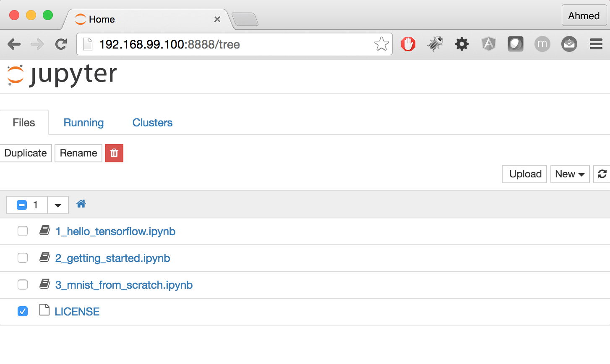
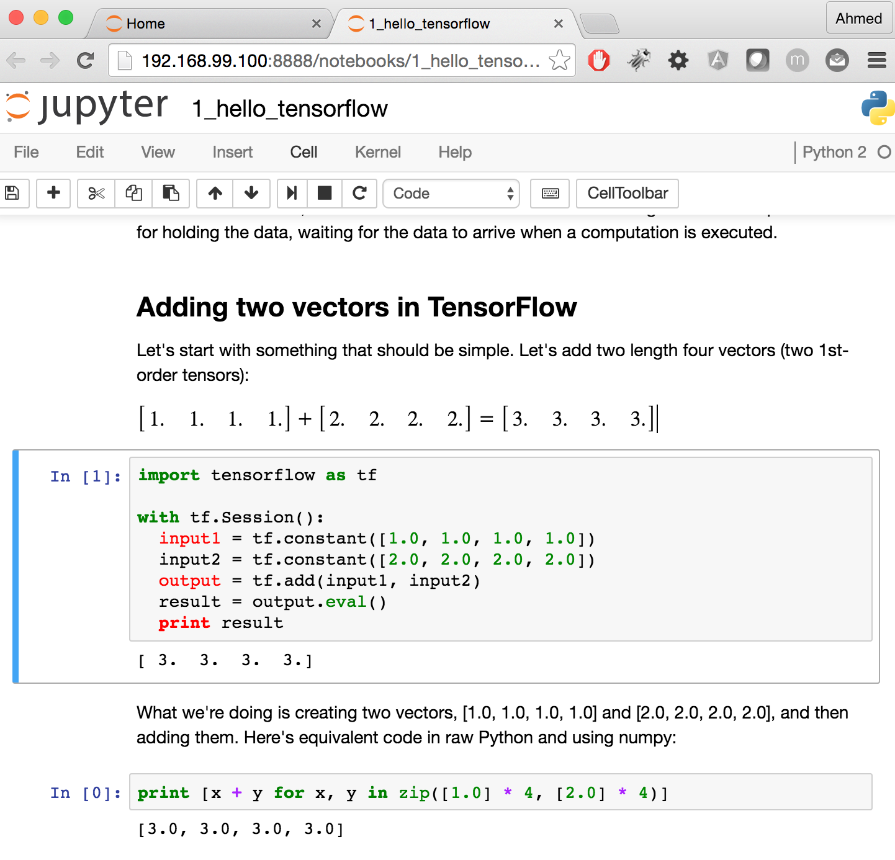

#How to install TensorFlow
This hands-on is meant to dive into the Google open-sourced machine learning library <a href="https://www.tensorflow.org/">TensorFlow</a>. 
Coding will be in Python 2.7 using <a href="http://ipython.org/notebook.html">IPython Notebook</a>.

I will explain here how to install TensorFlow on Mac or Linux.
For the windows users, you could follow the instructions described in <a href="http://www.netinstructions.com/how-to-install-and-run-tensorflow-on-a-windows-pc/">How to install and run TensorFlow on a Windows PC</a>. However, windows users should read this following tutorial especially the last section as the instructions are a bit similar for the three operating systems.

There are three types of install:
<ul>
	<li><strong>Pip</strong>: Install TensorFlow directly on your computer. You need to have Python 2.7 and pip installed</li>
	<li><strong>Virtualenv</strong>: Install TensorFlow in an isolated (virtual) Python environment.</li>
	<li><strong>Docker</strong>: Run TensorFlow in an isolated Docker container (virtual machine) on your computer.</li>
</ul>

If you would like to use the two first methods, You could follow instructions in <a href="https://www.tensorflow.org/versions/master/get_started/os_setup.html#download-and-setup"> download and setup TensorFlow</a>.

Here, I will explain the Docker method. I think it is the easiest method as it ensures that all dependencies required are available.
It could be confusing to use docker initially. Docker is very useful to package a piece of software with all its dependencies. Moreover, it allows us to have the same developpement environnement through the training session.
## Setup
<ol>
	<li>Install docker. Follow the instructions in:
		<ul> 
			<li>https://docs.docker.com/mac/step_one/ for Mac</li>
			<li>https://docs.docker.com/engine/installation/ for Linux and choose your Linux distribution</li>
		</ul>
	</li>
	<li>Mac users should open "Docker Quickstart Terminal".</li>
	<li>Type: ```docker run -it b.gcr.io/tensorflow/tensorflow /bin/bash```
		<ul>
			<li>```docker run```: to run a given image.</li>
			<li>```-i```: stands for interactive.</li>
			<li>```b.gcr.io/tensorflow/tensorflow```: one of TensorFlow images provided by Google. when run this command at the first time, we will get the following response: ```Unable to find image 'b.gcr.io/tensorflow/tensorflow:latest' locally latest: Pulling from tensorflow/tensorflow``` and the download of the image from Google Cloud Repository will start. It will take some minutes. .</li>
			<li>```/bin/bash```: is the process to launch</li>
		</ul></li>
</ol>
##Testing
Type "ipython". After getting the promt of ipython, type the following code lines.

After you type the last line you should see a response "Hello, World!".
## IPython Notebook
In the TensorFlow image, we can find three ipython notebooks in the "notebooks" folders: 1_hello_tensorflow.ipynb, 2_getting_started.ipynb, 3_mnist_from_scratch.ipynb.

The IPython Notebook is an interactive computational environment, in which you can combine code execution, text, mathematics, plots.

Type ```ipython notebook``` to launch IPython Notebook web application. 
To get access to the Notebooks, go to the browser and
<ul>
	<li>type http://127.0.0.1:8888 on Linux.</li>
	<li>On mac, find the virtual machine's IP using:
		```docker-machine ip default``` 
		Then go to: http://IP:8888 (likely http://192.168.99.100:8888)</li>
</ul>
We could see on the browser the three notebooks.

Click for example on the first one "1_hello_tensorflow.ipynb".
The notebook is split into cells: a cell can contain python code or text. You can execute a cell by clicking on it and pressing Shift-Enter. When you do so, the code in the cell will run, and the output of the cell will be displayed beneath the cell. You can also add more cells and write more codes.

<strong color="red">I strongly recommand you to read those three notebooks and play with before the our training session.</strong>

